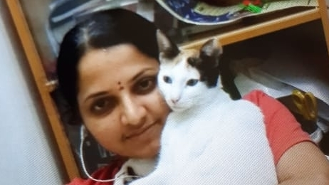
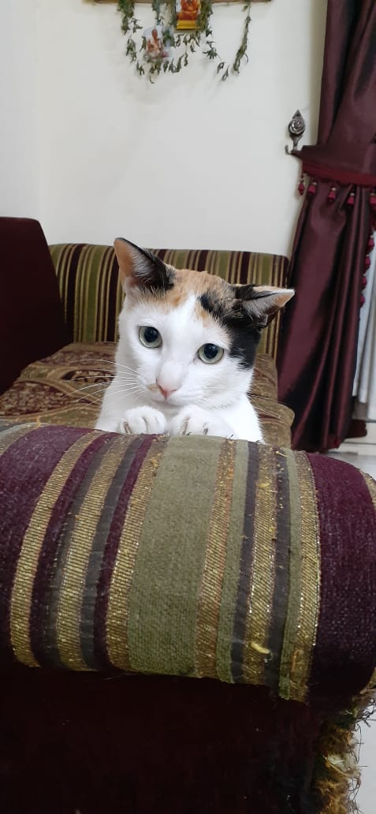
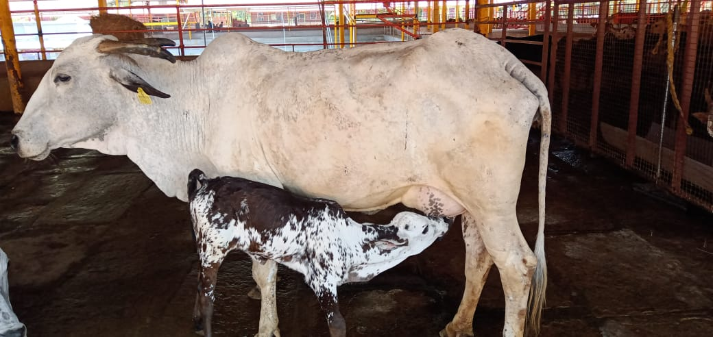

ಅವರು ಕರ್ನಾಟಕದ ಬಂಟ್ವಾಳದ ವಿಟ್ಲಪಡ್ನೂರಿನ "ದಿವಾಣ" ಮನೆತನದ  ಶ್ರೀ ಜನಾರ್ದನ ಭಟ್ಟ ಮತ್ತು ಶ್ರೀಮತಿ ಸ್ಚರ್ಣಗೌರಿ ಸಾಯ ದಂಪತಿ. ಅವರಿಗೊಬ್ಬ ಪುಟ್ಟ ಮಗಳು ಕೃತಿ ಭಟ್ ದಿವಾಣ! ಶ್ರೀ ಜನಾರ್ದನ ಭಟ್ಟರು
ದುಬೈನ, ದುಬೈನಿಂದ 150 ಕಿ.ಮೀ ದೂರದಲ್ಲಿರುವ  "ರಾಸ್ ಅಲ್ ಖೈಮಾ" ಊರಿನಲ್ಲಿರುವ RAK ceramics - ನಲ್ಲಿ ಇಂಜನಿಯರಾಗಿ ಕಾರ್ಯನಿರ್ವಹಿಸುತ್ತಿದ್ದಾರೆ. ಶ್ರೀ ಜನಾರ್ದನ ಭಟ್,  ಶ್ರೀಮತಿ ಸ್ವರ್ಣಗೌರಿ ಸಾಯ ಮತ್ತು ಮಗಳು ಕೃತಿ ಅಸೀಮ ಗುರುಭಕ್ತರು. ಪ್ರಾಣಿಪ್ರಿಯರು.  ಧರ್ಮಭೀರುಗಳು. ಸನಾತನ ಸಂಸ್ಕೃತಿಯ ಅಪ್ಪಟ ಮನೆಮಕ್ಕಳು!! ಅಲ್ಲಿದ್ದರೂ ಇಲ್ಲಿ ಮಠದಲ್ಲಿ ಶ್ರೀಗುರುಗಳು  ನಡೆಸುವ ಧಾರ್ಮಿಕ ಕಾರ್ಯಕ್ರಮಗಳಲ್ಲಿ ಮನವೊಂದಾಗಿ, ಅಲ್ಲಿ ಅಕ್ಕಪಕ್ಕದ ಮನೆಯ ಮಾತೆಯರನ್ನೂ ಕರೆಸಿ, ಕಾರ್ಯಕ್ರಮ ನಡೆಸಿ, ಭಕ್ತಿಪ್ರಸಾದ ಹಂಚುವವರು!

 ಮಗಳಿಗೆ ಪುಟ್ಟ ಕರುವನ್ನು ಸಾಕಬೇಕೆಂಬ ಅತಿಹಂಬಲವಿದ್ದರೂ, ಅಲ್ಲಿನ ಕಾನೂನಿನ ತೊಡಕಿನಿಂದಾಗಿ ಮನೆಯಲ್ಲಿ ಪ್ರಾಣಿ ಸಾಕುವುದು ಕಷ್ಟದ ಮಾತು. ಹೀಗಿದ್ದಾಗ ಅಕಸ್ಮಾತ್ ಆಗಿ ಕೇವಲ ೧೫ ದಿನಗಳ ಪ್ರಾಯದ ಬೆಕ್ಕಿನ ಮರಿಯೊಂದು ಅನಾಥಗತಿಯಲ್ಲಿ ದಿನಾಂಕ 05-04-2017 ರಂದು ದೊರೆತಾಗ, ನಿಯಮಾವಳಿಗಳಿಗೆ ಎದೆಗುಂದದೇ, ಆ ಪುಟ್ಟಮರಿಗೆ ಆಶ್ರಯವಾಯಿತು ಈ ಕುಟುಂಬ! ಬೆಕ್ಕಿನಮರಿಗೆ "ರಾಣಿ" ಎಂದು ಹೆಸರಿಟ್ಟು  ಮುದ್ದಾಗಿ ಸಾಕಿದರು! ಮನೆಯ ಸದಸ್ಯೆಯಾಗಿ ಉಳಿಯಿತು, ಬೆಳೆಯಿತು ರಾಣಿ!!

ಆಶ್ಚರ್ಯವೆನ್ನುವುದೋ... ಪೂರ್ವಸುಕೃತವೆನ್ನುವುದೋ... ಪವಾಡವೆನ್ನುವುದೋ..

"ರಾಣಿ" ಶುದ್ಧ ಸಸ್ಯಾಹಾರಿ!
ಮನೆಮಂದಿಗೆ ಅನಾರೋಗ್ಯವಾದಾಗ ಅವರೊಂದಿಗೇ ಸಮಯ ಕಳೆದು, ತನ್ನ‌ದೇ  ಭಾಷೆಯಲ್ಲಿ  ಸೇವೆಗೈವಳು "ರಾಣಿ"! ನಿತ್ಯ ಪೂಜೆಯ ಹೊತ್ತಿಗೆ ಅಲ್ಲಿಯೇ ಕುಳಿತು, ತೀರ್ಥ- ಪ್ರಸಾದ ಸ್ವೀಕರಿಸುವಳು "ರಾಣಿ" ! 

ಇವಿಷ್ಟೇ ಅಲ್ಲ... ರಾಣಿಯ ಗುಣವಿಶೇಷ! ಕೇಳಿದರೆ ನೀವು ಬೆರಗಾಗುತ್ತೀರಿ! ರಾಣಿ ನಮ್ಮ  Sri Raghaveshwara Bharati Swamiji   ಗಳ‌ ಪರಮ ಭಕ್ತೆ! ಶ್ರೀಗಳ ಭಾವಚಿತ್ರದೆದುರು ನೋಡುತ್ತಾ ಕೂರುವುದು! "ಧಾರಾ- ರಾಮಾಯಣ" ವನ್ನು ಪ್ರತಿನಿತ್ಯ ಕೇಳಿದ- ನೋಡಿದ ಧೀಮತಿ "ರಾಣಿ"! 

ಕಳೆದ ಮೂರು ವರ್ಷಗಳಿಂದ   ಮನೆಯವರ ಭಾವ- ಬಿಂಬವೇ ಆಗಿದ್ದ "ರಾಣಿ" ಗೆ  ತುಂಬಾ ನೋವಿನ ವಿಚಾರವೊಂದು ತಿಳಿಯಿತು! ತಾಯ್ನಾಡಿಗೆ ಮರಳಲೆಂದು ದಿವಾಣ ಕುಟುಂಬವು ನಿರ್ಣಯಿಸಿ, "ರಾಣಿ" ಯನ್ನೂ ಕರೆತರುವುದೆಂದು ದಾಖಲೆಗಳನ್ನೆಲ್ಲಾ ಸಿದ್ಧವಾಗಿಟ್ಟುಕೊಂಡಿದ್ದರು! ಆದರೆ ಈ ಕೊರೋನಾ ಎಂಬ ಹೆಮ್ಮಾರಿ ಯಾರ್ಯಾರಿಗೆ ಎಂತೆಂಥ ನೋವುಣ್ಣಿಸಿತೊ ಭಗವಂತ ಬಲ್ಲ! "ಕೊರೋನಾ ಕಾರಣವಾಗಿ ನಿನ್ನನ್ನು ಕರೆದೊಯ್ಯವುದು ಕಷ್ಟವಾಗುತ್ತಿದೆ ರಾಣೀ... ಹೀಗ್ಹೀಗೆ ಪರಿಸ್ಥಿತಿ ಇದೆ" ಎಂದು ರಾಣಿಯನ್ನು ಕೂರಿಸಿಕೊಂಡು ಹೇಳಲಾಯಿತು! ಅದೇನಾಯಿತೋ... ಅಂದಿನಿಂದ ರಾಣಿ ಅನ್ನಾಹಾರ ತ್ಯಜಿಸಿದಳು... ಕಡುವೇದನೆಯಿಂದ ಎಲ್ಲರನ್ನೂ ನೋಡತೊಡಗಿದಳು... ಮುಖಬಾಡಿ, ತನುನಡುಗಿ ಅಸಹಾಯಕ ಸ್ಥಿತಿ ತಲುಪಿದಳು... ನಡೆಯಲಾರದ ಸ್ಥಿತಿಯಲ್ಲಿಯೂ ದೇವರಕೋಣೆಗೆ ಬಂದು ತುಳಸೀ ತೀರ್ಥ ಕುಡಿದು-ಇಂದು ದಿನಾಂಕ 28-03-2020 ರಂದು ಅಸುನೀಗಿದಳು!!! 

ಅನುದಿನವೂ ಅನುಕ್ಷಣವೂ ಜೊತೆಗಿದ್ದು, ತಮ್ಮಲ್ಲೊಂದಾಗಿದ್ದ ರಾಣಿಯನ್ನು ಇಂದು ಕಳೆದುಕೊಂಡ ಕುಟುಂಬದ ದುಃಖ,ನೋವು... ಬಣ್ಣಿಸಲಾಗದ್ದು!

ತಕ್ಷಣ ತೆಗೆದುಕೊಂಡ ನಿರ್ಣಯವೆಂದರೆ ಅವಳ ನೆನಪಿನಲ್ಲಿ ಗೋವೊಂದನ್ನು ದತ್ತುಪಡೆಯುವುದು! ರಾಣಿಯ ಔಷಧಿಗೆ, ಉಪಚಾರಕ್ಕೆ ಎಂದು ಮನೆಪಾಠ ಮಾಡಿ ಸಂಗ್ರಹಿಸಿದ ಹಣವನ್ನು ಈ ಶುಭಕಾರ್ಯಕ್ಕೆ ಉಪಯೋಗಿಸುವುದು ಎಂದು  'ಶ್ರೀಮತಿ ಸ್ವರ್ಣಗೌರಿ ಸಾಯ' ಆಲೋಚಿಸಿದರು. ನಮ್ಮ ಶ್ರೀರಾಮಚಂದ್ರಾಪುರ ಮಠವನ್ನು ಸಂಪರ್ಕಿಸಿದರು. ತಕ್ಷಣವೇ ಸವತ್ಸ ಗೋವು ಸ್ವರ್ಣಗೌರಿ ಸಾಯ ಅವರ ದತ್ತುಮಗುವಾಯಿತು. ಸ್ವರ್ಣಗೌರಿಯವರ ಅಪೇಕ್ಷೆಯಂತೆ ಗೋವಿಗೆ "ಶ್ವೇತಾ" ಎಂದೂ, ಕರುವಿಗೆ "ರಾಣಿ" ಎಂದೂ ನಾಮಕರಣ ಮಾಡಲಾಯಿತು! ಸ್ವರ್ಣಗೌರಿ ಸಾಯ- ದಿವಾಣ ಕುಟುಂಬದ ಈ ನಡೆ ಸಕಲರಿಗೂ ಮಾದರಿ!!

ಇಂದು ನಮ್ಮ ಶ್ರೀರಾಮನ #ದೀಕ್ಷಾ_ದಿನ ! ಇಂದು ಪ್ರಾಣ ತ್ಯಜಿಸಿ, ಸವತ್ಸ ಗೋವೊಂದಕ್ಕೆ ಆಶ್ರಯ ಒದಗಿಸಿ, ಇಹಲೋಕ ತ್ಯಜಿಸಿದ ಗುರುಭಕ್ತೆ "ರಾಣಿ" , ಹುಡುಕೀ ಹುಡುಕೀ ಗುರುಭಕ್ತರ ಆಶ್ರಯದಲ್ಲಿ ಬಂದುದೂ, ನಿತ್ಯಗುರುವಿನ ಭಾವಚಿತ್ರ ನೋಡುವುದೂ, ಧಾರಾರಾಮಾಯಣ ನೋಡುವುದೂ... ಇತ್ಯಾದಿ ಗಮನಿಸಿದರೆ ... ಹೀಗೆ ಹಾರೈಸುತ್ತದೆ ಮನಸು...

"ಮತ್ತೆ ಹುಟ್ಟು ರಾಣಿ... ಮಾನವ ಶಿಶುವಾಗಿ ಬಾ...  ಸ್ವರ್ಣಗೌರಿಯಂಥ ಗುರುಭಕ್ತರ ಮನೆಯ ಮಗುವಾಗು ಕಂದಾ!  ಶ್ರೀಗುರುವಿನ ಶಿಷ್ಯಳಾಗಿ ಪರಮಾಶ್ರಯ ಪಡೆದು ಭಕ್ತಿಮಾರ್ಗದಲಿ ಬದುಕು! ನಿನ್ನ ಮತ್ತೆ ಕಾಣುವ ಸೌಭಾಗ್ಯ ಸಕಲರಿಗೂ ದೊರೆಯಲಿ. ಗುರುಕರುಣೆ ನಿನಗಿರಲಿ"!!

ಹೌದು ತಾನೇ?

( ಮೊದಲ ಭಾವಚಿತ್ರದಲ್ಲಿ ಸ್ವರ್ಣಗೌರಿಯೊಂದಿಗೆ ಇಯರ್ ಫೋನ್ ಹಾಕಿಕೊಂಡು ಧಾರಾರಾಮಾಯಣ ನೋಡುತ್ತಿರುವುದು!)

-- ಗುರುಚರಣಸೇವಕಿ ಲಲಿತಾಲಕ್ಷ್ಮೀ

